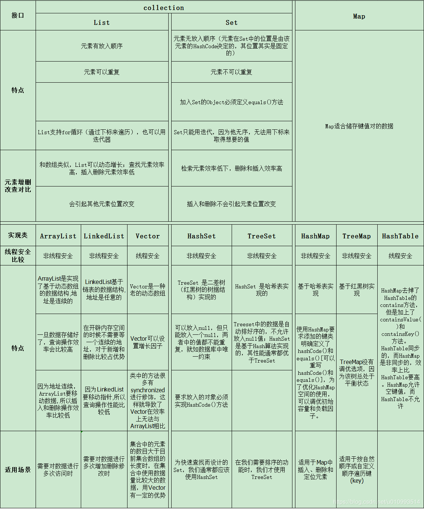

# 一、环境搭建

## 1、basic

1. 核心优势：跨平台	|||||||	分布式、多线程
2. javaSE：java standard edition==》标准版，定位在个人计算机上的应用。c++更优秀。
3. javaEE：java enterprise edition==》企业版，定位在服务器端的应用。eg：银行操作员
4. javaME：java micro edition==》微型版，定位在消费性电子产品的应用。趋向消亡

## 2、java应用程序的运行机制

计算机高级语言的类型主要有编译型和解释性，java是两种类型的结合。

java首先利用文本编译器编写java源程序（.java），再利用编译器（javac）将源文件编译成字节码文件（.class），最后利用虚拟机（java 解释器）执行。

.class --> jre[ 类加载器--字节码校验器--解释器jvm] -->系统平台

## 3、jdk、jre、jvm

jdk：java development kit	包含jre  +  javac、jar、debugging、tools、javap

​	以及增加可编译器和调试器等用于程序开发的文件。

jre：java runtime environment	包含jvm  +  java、javaw、libraries、rt.jar

​	java虚拟机、库函数、运行java应用程序所必须的文件。

jvm：java virtual machine	java虚拟机机制屏蔽了底层运行平台的差别，实现一次编译，随处运行。java虚拟机是实现跨平台的核心机制。

# 二、基础语法

## 1、常量和变量

**常量**指的是一个固定的值，eg： 1,2,3，"年后"...

用final来定义一个常量，常量一旦被初始化后便不能在更改其值,通常字母全大写。

注意：1、被final修饰的方法不能被子类重写，但可以在本类中重载

​			2、被fianl修饰的类不能被继承

**变量**

局部变量：方法或语句块内风变量。

成员变量：方法外部，类内部的变量，从属于对象，也称实例变量，会自动初始化为默认值。

​	int： 0	double： 0.0	char： \u0000	boolean： false

静态变量：static修饰，也称类变量，从属于类

## 2、数据类型

### 基本数据类型

bit(位)	byte(字节)	KB	M				二进制0b开头	八进制0开头，十六进制0X开头

primitive data type： **byte、short、int、long、float、double、char、boolean**	1248482+1位

byte：-2[^7]--- 2[^7]-1	（-128 --- 127）

short：-2[^15] --- 2[^15]-1	（-32768 --- 32767）

int：-2[^31] --- 2[^31]-1	（-2147483648--- 2147483647）,约21亿

long：-2[^63] --- 2[^63]-1	+L/l

float：-3.403E-38 --- 3.403E38	单精度，精确到7位有效数字，+f/F

double：-1.798E308 --- 1.798E308	双精度浮点数计算时不精确，需要使用**BigInteger** 或**BigDecimal**来计算

char：字符，Unicode被设计用来处理各种语言的文字，它占2个字节，可允许有65536个字符\u0000 - \uFFFF

注意：

### 引用数据类型

class、interface、数组	==	占四个字节，代表对象的地址

## 3、运算符

### 关系运算符

\> 	\<	>=	<=	==	!=	instanceof

### 位运算符

&	|	^	~	>>	<<	>>>

说明：<<	左移1位，相当于10进制乘以10

### 逻辑运算符

&	|	&&	||	！	^

说明：逻辑&，两个操作数都为true，结果才是true	逻辑|，有一个操作数为true，结果就是true

​			短路&&，有一个为false，结果就是false	短路||，只要有一个为true，结果就是true

​			逻辑^：相同为false，不同为true

​			&&的优先级大于||

短路说明：从左到右计算，如果只通过左边的运算就能得到结果，右边的就不会计算，提高效率

~~~java
import java.util.Scanner;
public class T {
	public static void main(String[] args) {
		Scanner sc = new Scanner(System.in);
		String str = sc.nextLine();
		System.out.println(str);
		sc.close();
	}
}	
~~~

~~~java
public static void main(String[] args) {
	kk:for (int i = 11; 10 < i && i< 20; i++) {
		for (int j = 2; j < i/2; j++) {
			if(i%j == 0) {
				continue kk;
			}
		}
		System.out.println(i+"是质数");
	}
}
11是质数
13是质数
17是质数
19是质数
~~~

C/S： client-server	客户端-->手机端

B/S： browser-server	浏览器

## 4、控制语句

if、if-else、while、switch--case、for、break、continue

1、switch在jdk8之后，可使用字符串充当比较条件。

2、break跳出当前的多重循环

~~~java
ok:
for (int i = 0; i < 10; i++) {
    System.out.println(i);
    for(int j = 0; j<3; j++) {
        System.out.println("j="+j);
        if(i == 2) {
            break ok;
        }
    }
}
System.out.println(111);
~~~

## 5、访问控制符

public、protected、private、默认修饰符（不写）、static、final、abstract

public：能被所有的类（接口、成员）访问。

protected：只能被同类、同包、子类访问，不能被非同包的类访问。如果再其他包中，则必须是该成员所属类的子类。

默认修饰符：只能被同类，同包访问，子类无法访问。

private：成员变量和方法都只能在定义它的类中被访问，其他类无法访问。

static：修饰变量，称为静态变量或类变量，所有实例共享该变量，在类初始化时加载。修饰方法，称为类方法，通过类名.调用。

final：被声明为fainal的变量必须在声明式给定初始值，且该值不能修改。修改类时，该类为最终类，无法派生子类，也就是没有子类。修饰方法时，该方法被子类不能被重写，但可以在本类中重载。

abstract：不能穿件abstract类的实例。一旦被继承，子类需要实现所有抽象方法。

| 访问级别 | 访问修饰符     | 同类 | 同包 | 子类 | 不同的包 |
| -------- | -------------- | ---- | ---- | ---- | -------- |
| 公开     | public         | √    | √    | √    | √        |
| 受保护   | protected      | √    | √    | √    | ×        |
| 默认     | 没有访问修饰符 | √    | √    | ×    | ×        |
| 私有     | private        | √    | ×    | ×    | ×        |

# 

# 三、面向对象

## 1、类与对象

 类是用于描述同一类型的对象的一个抽象的概念，类中定义了这一类对象所因具有静态和动态属性。 类可以看成一类对象（object）的模版，对象可以看成该类的一个具体实例（instance）。 

## 2、 抽象类与接口

**接口和抽象类的区别：**

（1）抽象类可以有构造方法，接口中不能有构造方法。

（2）抽象类中可以有普通成员变量，接口中没有普通成员变量

（3）抽象类中可以包含静态方法，接口中不能包含静态方法

（4） 一个类可以实现多个接口，但只能继承一个抽象类。

（5）接口可以被多重实现，抽象类只能被单一继承

（6）如果抽象类实现接口，则可以把接口中方法映射到抽象类中作为抽象方法而不必实现，而在抽象类的子类中实现接口中方法

**接口和抽象类的相同点：**

(1) 都可以被继承

(2) 都不能被实例化

(3) 都可以包含方法声明

(4) 派生类必须实现未实现的方法

## 3、封装、继承、多态

 **封装**就是指，将类的属性私有化，提供公开的方法去访问的方式，就叫做封装。  好处：提高代码的复用性；隐藏了实现细节，还要对外提供可以访问的方式；提高了安全性 。

**继承**是多个类中存在相同属性和行为时，将这些内容抽取到单独一个类中，那么多个类无需再定义这些属性和行为，只要继承那个类即可。 好处： 提高了代码的复用性； 让类与类之间产生了关系，提供了多态的前提。 

**多态**是多个不同类对象可以响应同一个方法，产生不同的结果 。 好处： **提高了代码的复用性**；  派生类的功能可以被基类的方法或引用变量所调用，这叫向后兼容，**可以提高可扩充性和可维护性**。 

## 4、泛型

## 5、内部类

## 6、异常

exception：分为checked异常和unchecked异常（RuntimeException运行时异常：不需要try...catch...或者throws处理的异常）。一般是因为程序员没有进行必须的检查引起，如NullPointException、ArithmaticException、ArrayIndexoutofBoundsException。

error：系统错误或者底层资源的错误，一般为底层的不可恢复的类。

# 四、数组

数组是在内存中存储相同数据类型的连续的空间。数组长度一旦声明，不可改变不可追加。

~~~java
int[] a = {1,2,3,4}
int b[] = new int[]{1,2,35,4,6};
//使用for循环遍历
for(int b:a) {
    System.out.println(b);
}
~~~

**数组排序**

- 冒泡排序

  每轮算出最大值排在最后

~~~java
int [] arr = {78,89,67,98,90,56,88};
for(int i=0; i<arr.length-1; i++){//控制比较的轮数
    for(int j=0; j<arr.length-1-i; j++){//控制每轮比较的次数
        if(arr[j]>arr[j+1]){
            int temp = arr[j];
            arr[j]  = arr[j+1];
            arr[j+1] = temp;
        }
    }
}
~~~

- 二分法查找


# 五、集合




Collection接口下的集合：List、Set、Queue

Map接口也是一种集合

## 1、List

List集合代表一个有序、可重复集合，集合中每个元素都有其对应的顺序索引。List集合默认按照元素的添加顺序设置元素的索引，可以通过索引（类似数组的下标）来访问指定位置的集合元素。 增删慢，查询快。

### **LinkedList**

**基于链表实现，链表内存是散列的，增删快，查找慢；**

LinkedList是List接口的另一个实现，除了可以根据索引访问集合元素外，LinkedList还实现了Deque接口，可以当作双端队列来使用，也就是说，既可以当作“栈”使用，又可以当作队列使用。

LinkedList的实现机制与ArrayList的实现机制完全不同，ArrayLiat内部以数组的形式保存集合的元素，所以随机访问集合元素有较好的性能；LinkedList内部以链表的形式保存集合中的元素，所以随机访问集合中的元素性能较差，但在插入删除元素时有较好的性能。

### **ArrayList**

**基于数组实现，非线程安全，效率高，增删慢，查找快；**

ArrayList是一个动态数组，也是我们最常用的集合，是List类的典型实现。它允许任何符合规则的元素插入甚至包括null。每一个ArrayList都有一个初始容量（10），该容量代表了数组的大小。随着容器中的元素不断增加，容器的大小也会随着增加。在每次向容器中增加元素的同时都会进行容量检查，当快溢出时，就会进行扩容操作。所以如果我们明确所插入元素的多少，最好指定一个初始容量值，避免过多的进行扩容操作而浪费时间、效率。 

### **Vector**

**基于数组实现，线程安全，效率低，增删慢，查找慢；**

与ArrayList相似，但是Vector是同步的。所以说Vector是线程安全的动态数组。它的操作与ArrayList几乎一样。

### **Stack**

Stack继承自Vector，实现一个后进先出的堆栈。Stack提供5个额外的方法使得Vector得以被当作堆栈使用。基本的push和pop 方法，还有peek方法得到栈顶的元素，empty方法测试堆栈是否为空，search方法检测一个元素在堆栈中的位置。Stack刚创建后是空栈。 

**Iterator接口和ListIterator接口** 

Iterator是一个接口，它是集合的迭代器。集合可以通过Iterator去遍历集合中的元素。Iterator提供的API接口如下：

　　♦ boolean hasNext()：判断集合里是否存在下一个元素。如果有，hasNext()方法返回 true。
　　♦ Object next()：返回集合里下一个元素。
　　♦ void remove()：删除集合里上一次next方法返回的元素。

　　ListIterator接口继承Iterator接口，提供了专门操作List的方法。ListIterator接口在Iterator接口的基础上增加了以下几个方法：

　　♦ boolean hasPrevious()：判断集合里是否存在上一个元素。如果有，该方法返回 true。
　　♦ Object previous()：返回集合里上一个元素。
　　♦ void add(Object o)：在指定位置插入一个元素。

　　以上两个接口相比较，不难发现，ListIterator增加了向前迭代的功能（Iterator只能向后迭代），ListIterator还可以通过add()方法向List集合中添加元素（Iterator只能删除元素）。

## 2、Set

元素无序不重复，没有下标，只能用迭代来取。增删块，查询慢

### **HashSet** 

HashSet是Set集合最常用实现类，是其经典实现。HashSet是按照hash算法来存储元素的，因此具有很好的存取和查找性能。 底层是由 HashMap 实现，不允许集合中有重复的值，使用该方式时需要重写 equals()与hashCode()方法； 

HashSet具有如下特点：

　　♦ 不能保证元素的顺序。

　　♦ HashSet不是线程同步的，如果多线程操作HashSet集合，则应通过代码来保证其同步。

　　♦ 集合元素值可以是null。

HashSet存储原理如下：

　　当向HashSet集合存储一个元素时，HashSet会调用该对象的hashCode()方法得到其hashCode值，然后根据hashCode值决定该对象的存储位置。HashSet集合判断两个元素相等的标准是(1)两个对象通过equals()方法比较返回true；(2)两个对象的hashCode()方法返回值相等。因此，如果(1)和(2)有一个不满足条件，则认为这两个对象不相等，可以添加成功。如果两个对象的hashCode()方法返回值相等，但是两个对象通过equals()方法比较返回false，HashSet会以链式结构将两个对象保存在同一位置，这将导致性能下降，因此在编码时应避免出现这种情况。

HashSet查找原理如下：

　　基于HashSet以上的存储原理，在查找元素时，HashSet先计算元素的HashCode值（也就是调用对象的hashCode方法的返回值），然后直接到hashCode值对应的位置去取出元素即可，这就是HashSet速度很快的原因。

重写hashCode()方法的基本原则如下：

 　   ♦ 在程序运行过程中，同一个对象的hashCode()方法返回值应相同。

　　♦ 当两个对象通过equals()方法比较返回true时，这两个对象的hashCode()方法返回值应该相等。

　　♦ 对象中用作equals()方法比较标准的实例变量，都应该用于计算hashCode值。

### **LinkedHashSet** 

基于 LinkedHashMap 来进行实现，底层使用的是 LinkedHashMap。 LinkedHashSet是HashSet的一个子类，具有HashSet的特性，也是根据元素的hashCode值来决定元素的存储位置。但它使用链表维护元素的次序，元素的顺序与添加顺序一致。由于LinkedHashSet需要维护元素的插入顺序，因此性能略低于HashSet，但在迭代访问Set里的全部元素时由很好的性能。 

### TreeSet

TreeSet时SortedSet接口的实现类，TreeSet可以保证元素处于排序状态，它采用红黑树的数据结构来存储集合元素。TreeSet支持两种排序方法：自然排序和定制排序，默认采用自然排序。

　　**♦ 自然排序**

　　TreeSet会调用集合元素的compareTo(Object obj)方法来比较元素的大小关系，然后将元素按照升序排列，这就是自然排序。如果试图将一个对象添加到TreeSet集合中，则该对象必须实现Comparable接口，否则会抛出异常。当一个对象调用方法与另一个对象比较时，例如obj1.compareTo(obj2)，如果该方法返回0，则两个对象相等；如果返回一个正数，则obj1大于obj2；如果返回一个负数，则obj1小于obj2。

　　Java常用类中已经实现了Comparable接口的类有以下几个：

　　♦ BigDecimal、BigDecimal以及所有数值型对应的包装类：按照它们对应的数值大小进行比较。

　　♦ Charchter：按照字符的unicode值进行比较。

　　♦ Boolean：true对应的包装类实例大于false对应的包装类实例。

　　♦ String：按照字符串中的字符的unicode值进行比较。

　　♦ Date、Time：后面的时间、日期比前面的时间、日期大。

　　对于TreeSet集合而言，它判断两个对象是否相等的标准是：两个对象通过compareTo(Object obj)方法比较是否返回0，如果返回0则相等。

 　**♦ 定制排序**

　　想要实现定制排序，需要在创建TreeSet集合对象时，提供一个Comparator对象与该TreeSet集合关联，由Comparator对象负责集合元素的排序逻辑。

　　综上：自然排序实现的是Comparable接口，定制排序实现的是Comparator接口。

~~~txt
HashSet的性能比TreeSet的性能好（特别是添加，查询元素时），因为TreeSet需要额外的红黑树算法维护元素的次序，如果需要一个保持排序的Set时才用TreeSet，否则应该使用HashSet。

　　LinkedHashSet是HashSet的子类，由于需要链表维护元素的顺序，所以插入和删除操作比HashSet要慢，但遍历比HashSet快。

　　EnumSet是所有Set实现类中性能最好的，但它只能 保存同一个枚举类的枚举值作为集合元素。

　　以上几个Set实现类都是线程不安全的，如果多线程访问，必须手动保证集合的同步性。
~~~


## 3、Queue

## 4、Map

Map接口采用键值对Map<K,V>的存储方式，保存具有映射关系的数据，因此，Map集合里保存两组值，一组值用于保存Map里的key，另外一组值用于保存Map里的value，key和value可以是任意引用类型的数据。key值不允许重复，可以为null。如果添加key-value对时Map中已经有重复的key，则新添加的value会覆盖该key原来对应的value。常用实现类有HashMap、LinkedHashMap、TreeMap等。 

### **HashMap** 

基于 hash 表的 Map 接口实现，非线程安全，高效，支持 null 值和 null 键； 

### **Hashtable**

线程安全，低效，不支持 null 值和 null 键； 

~~~txt
HashMap与Hashtable是Map接口的两个典型实现，它们之间的关系完全类似于ArrayList与Vertor。HashTable是一个古老的Map实现类，它提供的方法比较繁琐，目前基本不用了，HashMap与Hashtable主要存在以下两个典型区别：

　　♦ HashMap是线程不安全，HashTable是线程安全的。

　　♦ HashMap可以使用null值最为key或value；Hashtable不允许使用null值作为key和value，如果把null放进HashTable中，将会发生空指针异常。

　　为了成功的在HashMap和Hashtable中存储和获取对象，用作key的对象必须实现hashCode()方法和equals()方法。

　　HashMap工作原理如下：

　　HashMap基于hashing原理，通过put()和get()方法存储和获取对象。当我们将键值对传递给put()方法时，它调用键对象的hashCode()方法来计算hashCode值，然后找到bucket位置来储存值对象。当获取对象时，通过键对象的equals()方法找到正确的键值对，然后返回对象。HashMap使用链表来解决碰撞问题，当发生碰撞了，对象将会存储在链表的下一个节点中。
~~~


### **LinkedHashMap** 

HashMap 的一个子类，保存了记录的插入顺序； 

 LinkedHashMap使用双向链表来维护key-value对的次序（其实只需要考虑key的次序即可），该链表负责维护Map的迭代顺序，与插入顺序一致，因此性能比HashMap低，但在迭代访问Map里的全部元素时有较好的性能。 

### TreeMap  

TreeMap，能够把它保存的记录根据键排序，默认是键值的升序排序.

TreeMap是SortedMap的实现类，是一个红黑树的数据结构，每个key-value对作为红黑树的一个节点。TreeMap存储key-value对时，需要根据key对节点进行排序。TreeMap也有两种排序方式：

　　♦ 自然排序：TreeMap的所有key必须实现Comparable接口，而且所有的key应该是同一个类的对象，否则会抛出ClassCastException。

　　♦ 定制排序：创建TreeMap时，传入一个Comparator对象，该对象负责对TreeMap中的所有key进行排序。

~~~txt
各Map实现类的性能分析

　　♦ HashMap通常比Hashtable（古老的线程安全的集合）要快

　　♦ TreeMap通常比HashMap、Hashtable要慢，因为TreeMap底层采用红黑树来管理key-value。

　　♦ LinkedHashMap比HashMap慢一点，因为它需要维护链表来爆出key-value的插入顺序。
~~~


# 六、常用API

## 1、String

 String类代表字符串。字符串的值在创建之后不能更改。字符串本身不能改变，但str变量中记录的地址值是可以改变的。底层原理是 byte[] 字节数组  底层原理是 byte[] 字节数组 。

~~~java
String s1 = new String(); //创建String对象，字符串中没有内容	
byte[] bys = new byte[]{97,98,99,100};
String s2 = new String(bys); // 创建String对象，把数组元素作为字符串的内容。s2=abcd
String s3 = new String(bys, 1, 3); //创建String对象，把一部分数组元素作为字符串的内容，参数offset为数组元素的起始索引位置，参数length为要几个元素	
char[] chs = new char[]{’a’,’b’,’c’,’d’,’e’};
String s4 = new String(chs); //创建String对象，把数组元素作为字符串的内容
String s5 = new String(chs, 0, 3);//创建String对象，把一部分数组元素作为字符串的内容，参数offset为数组元素的起始索引位置，参数count为要几个元素
~~~

 若想操作可变的字符串，可以用字符串缓冲区。StringBuffer就是字符串缓冲区，它是一个容器，可以装很多字符串，并能进行操作 。

~~~java
StringBuffer sb = new StringBuffer();
sb.append("haha"); //添加字符串
sb.insert(2, "it");//在指定位置插入
sb.delete(1, 4);//删除
sb.replace(1, 4, "cast");//替换指定范围内的内容
~~~

**字符串转换**

- char[] toCharArray()：将字符串拆分成字符数组，返回该字符数组
- byte[] getBytes()：获取字符串底层字节数组，返回该字节数组的地址值（引用对象）

~~~java
public static void main(String[] args){
    String strA = "中国";

    // 返回字符数组
    System.out.println(strA.toCharArray());  // 中国

    // 返回字节数组(返回的是对象的引用)
    byte[] byteArray1 = strA.getBytes();
    System.out.println(byteArray1);  // [B@1e643faf
    for (int i = 0; i < strA.length(); i++){
        System.out.print(byteArray1[i]);  // -28-72
        if (i == strA.length() - 1){
            System.out.println();
        }
    }

    byte[] byteArray2 = "abc".getBytes();
    System.out.println(byteArray2);  // [B@6e8dacdf
    for (int i = 0; i < "abc".length(); i++){
        System.out.print(byteArray2[i]);  // 979899
        if (i == "abc".length() - 1){
            System.out.println();
        }
    }

    // 字符串替换
    System.out.println(strA.replace("中", "爱"));  // 爱国
}
~~~


## 2、Scanner

 Scanner 类可以实现键盘输入 。

~~~java
public static void main(String[] args) {
    Scanner scanner = new Scanner(System.in);

    // 让用户输入一个整数，用户输入的不是整数会抛出异常（InputMismatchException）
    int num = scanner.nextInt();
    // 输入一个字符串
    String str = scanner.next();
    System.out.println(num + str);
}
~~~


## 3、Math和Random

**Math**

Math.ceil()：向上取整。 Math.ceil(11.3)=12;Math.ceil(-11.3) = -11。 	//返回值是double类型

Math.floor()：向下取整。 Math.floor(11.6)=12;Math.floor(-11.6) = -12 	//返回值是double类型

Math.round()：四舍五入。 Math.round(-11.3) = -11;	//返回值是long类型

Math.random()：随机生成大于等于0，小于1的小数。	//返回值是double类型

随机产生数的两种方法：

~~~text
Random r = new Random();
int n = r.nextInt(最大值 - 最小值 + 1) + 最小值;

int n = Math.random()*(最大值 - 最小值 + 1) + 最小值;
~~~

**Random**

Random 类可用来生成一个随机数；Random random = new Random()

获取一个随机 int 数字（默认是 int 所有范围，有正负两种）：int num = random.nextInt();

获取一个随机 int 数字（指定范围 [0, 99)，规则是**顾前不顾尾**）：int num = random.nextInt(100);

**BigDecimal**

构造方法：

~~~java
public BigDecimal(double val)	//不建议使用
public BigDecimal(int val)	//推荐
public  BigDecimal(String val)	//推荐
//参数类型为double的构造方法有一定的不可预知性，而String参数类型的构造方法是完全可预知的。
//当double必须作为参数是，推荐使用Double.toString(double)转成String在使用，或者使用
//BigDecimal的静态方法valueOf()。BigDecimal.valueOf(2.3)。
~~~

加减乘除

~~~java
public BigDecimal add(BigDecimal val);	//加法
public BigDecimal subtract(BigDecimal val);	//减法
Public BigDecimal multiply(BigDecimal val);	//乘法
Public BigDecimal divide(BigDecimal val);	//除法
~~~

BigDecimal除法可能出现不能整除的情况，比如4.5/1.3。这时会报ArithmeticException异常。

这时可用divide的重载方法：

~~~java
Public BigDecimal divide(BigDecimal val,int scale,int roundingMode);
//第一个参数表示被除数，第二个表示小数点后保留几位小数，第三个表示舍入模式
~~~

舍入模式：	

ROUND_CEILING	//向正无穷方向舍入

ROUND_DOWN	//向零方向舍入

ROUND_FLOOR	//向负无穷方向取舍

ROUND_HALF_DOWN	//向距离最近的一边舍入，如果两边一样，则向下取舍

ROUND_HALF_EVEN	//

ROUND_HALF_UP	//向距离最近的一边舍入，除非两边一样，此时向上取舍（四舍五入）

ROUND_UNNECESSARY	//计算结果是精确地，不需要舍入

ROUND_UP	//向远离零的方向舍入

~~~java
BigDecimal a = new BigDecimal("3.3425");
a = a.setScale(3, RoundingMode.HALF_UP);
System.out.println(a);//3.343
~~~

加减乘除最终返回的都是一个新的BigDecimal对象，因为BigInteger和BigDecinal都是不可变的（immutable）。setScale不会返回新的对象。

## 4、Arrays

java.util.Arrays 类是一个与数组相关的工具类，里面提供了大量静态方法，用来实现常见的数组操作

public static String toString(参数数组)：将参数数组转换为字符串返回(按照默认格式：[element1, element2, element3 …])

public static void sort(参数数组)：将当前数组进行排序，默认升序

public static void binarySearch(参数数组，指定元素)： 在指定数组中，查找给定元素值出现的位置。若没有查询到，返回位置为-1。要求该数组必须是个有序的数组。 

~~~java
int[] arrayNum = {5, 1, 6, 3, 9};
String[] arrayString = {"bbb", "ccc", "aaa"};

// toString()
System.out.println(Arrays.toString(arrayNum));  // [5, 1, 6, 3, 9]

// sort()
Arrays.sort(arrayNum);
System.out.println(Arrays.toString(arrayNum));  // [1, 3, 5, 6, 9]
Arrays.sort(arrayString);
System.out.println(Arrays.toString(arrayString));  // [aaa, bbb, ccc]

int[] arr = {1,3,4,5,6};
int index = Arrays.binarySearch(arr, 4); //index的值为2
int index2= Arrasy.binarySearch(arr, 2); //index2的值为-1
~~~


## 5、日期类

java.util

- Date
- Calendar

java.time(jdk>=1.8)

- LocalDate
- LocalTime
- ZonedDateTime
- Instant

新API的特点:

- 严格区分日期,时间
- 不变类(类似于String)
- Month范围1-12(Jan-Dec)
- Week范围1-7(Mon-Sun)

### Date

**主要方法**

- toString() 把Date对象变成字符串
- getTime()把Date对象转换成时间戳

~~~java
Date now = new Date();
System.out.println(now);//Wed Jun 05 14:03:26 CST 2019
System.out.println(now.toString());// 把now转换成字符形式;Wed Jun 05 14:03:26 CST 2019
System.out.println(now.getTime());// 通过now获取时间戳;1559714606831
~~~

存在问题：不能转换时区，日期和时间的加减，两个日期相差多少天，计算某个月第一个星期一。

### SimpleDateFormat

yyyy: 年	MM: 月	dd: 日	HH: 时	mm: 分	ss: 秒

~~~java
Date now = new Date();
// 把Date按照格式转换成字符串
SimpleDateFormat sdf = new SimpleDateFormat("yyyy-MM-dd HH:mm:ss");
System.out.println(sdf.format(now));

// 把字符串按照格式转换成Date对象
String s1 = "2016-11-20 12:15:35";
Date date1 = sdf.parse(s1);
System.out.println(date1);
~~~

### Calendar(日历)

导入: `import java.util.Calendar`

```java
 // 创建实例
Calendar c = Calendar.getInstance();
int y = c.get(Calendar.YEAR);
int m = c.get(Calendar.MONTH);// 得到的月份比实际月份小1
int d = c.get(Calendar.DAY_OF_MONTH);
int w = c.get(Calendar.DAY_OF_WEEK);
int hh = c.get(Calendar.HOUR_OF_DAY);
int mm = c.get(Calendar.MINUTE);
int ss = c.get(Calendar.SECOND);
int ms = c.get(Calendar.MILLISECOND);
Date date = c.getTime();
// 获得时间戳
long ms1 = c.getTimeInMillis();
```

- Date c.getTime() 获得Date对象
- long getTimelnMillis() 获得毫秒数
- get(int field) 获得年月日, 时分秒
- setTime(Date) 设定时间
- setTimeInMillis(long) 根据时间戳设置时间
- set(int field, int value) 根据年月日等设定时间
- setTimeZone(TimeZone) 更改时区

```
c.setTimeZone(TimeZone.getTimeZone("America/New_York"))
```

- add(int field, int value)

```java
// +5 day
c.add(Calendar.DAY_OF_MONTH, 5);
// -2 hours
c.add(Calendar.HOUR_OF_DAY, -2);
```

### LocalDateTime

**获取当前日期和时间**

- LocalDate
- LocalTime
- LocalDateTime

```java
// 当前日期
LocalDate ld = LocalDate.now();
// 当前时间
LocalTime lt = LocalTime.now();
// 当前日期和时间
LocalDateTime ldt = LocalDateTime.now();

// 指定日期和时间
LocalDate ld2 = LocalDate.of(2016, 11, 30);
LocalTime lt2 = LocalTime.of(15, 16, 17);
LocalDateTime ldt2 = LocalDateTime.of(2016, 11, 30, 15, 16, 17);
LocalDateTime ldt3 = LocalDateTime.of(ld2, lt2);
```

**DateTimeFormatter**

```java
DateTimeFormatter dtf = DateTimeFormatter.ofPattern("yyyy-MM-dd HH:mm:ss");
System.out.println(dtf.format(LocalDateTime.now()));
LocalDateTime dt3 = LocalDateTime.parse("2016-12-30 15:16:17", dtf);
System.out.println(dt3);//2016-12-30T15:16:17
```

**日期和时间的运算**

增加:

- plusYears(1): +1年
- plusMonths(1): +1月
- plusDays(1): +1天
- plusHours(1): +1小时
- plusMinutes(1): +1 分钟
- plusSeconds(1): +1 秒

减少

- minusYears(1): +1年
- minusMonths(1): +1月
- minusDays(1): +1天
- minusHours(1): +1小时
- minusMinutes(1): +1 分钟
- minusSeconds(1): +1 秒

```java
LocalDateTime now = LocalDateTime.now();
LocalDateTime d = now.plusDays(1).minusHours(1);
```

调整年, 月,日, 时, 分, 秒

- withYear(2018): 调整年
- withMonth(): 调整月
- withDayOfMonth(): 调整为本月的第几天
- withDayOfYear(): 调整本年的第几天
- withHour(): 调整小时
- withMinute(): 调整分钟
- withSecond(): 调整秒

判断日期和时间的先后:

- isBefore()
- isAfter()
- equals()

计算两个日期的相差时间:Period

```java
	LocalDate d1 = LocalDate.of(2018, 11, 20);
	LocalDate d2 = LocalDate.of(2050, 1, 2);
	Period p = d1.until(d2);
	System.out.println(p);// P31Y1M13D  
	// 两个日期相差多少天
	System.out.println(Math.abs(d1.toEpochDay() - d2.toEpochDay()));// 11366
```

- p.getYears()
- p.getMonths()
- p.getDays()

### **ZonedDateTime**

ZonedDateTime = LocalDateTime + ZoneId

- ZonedDateTime: 带时区的日期和时间
- ZoneId: 新时区对象(取代就的java.util.TimeZone)
- Instant: 时刻对象(内部用long表示epoch seconds)

```java
ZonedDateTime zbj = ZonedDateTime.now();// 当前时区的日期和时间
ZonedDateTime zny = ZonedDateTime.now(ZoneId.of("America/New_York"));// 纽约时区的日期和时间
// 北京时区变成纽约时区
ZonedDateTime ny = zbj.withZoneSameInstant(ZoneId.of("America/New_York"));
// 把LocalDateTime转换成ZonedDateTime
ZonedDateTime bj = LocalDateTime.now().atZone(ZoneId.systemDefault());
```

Instant: 对象表示某个时刻

```java
Instant ins1 = Instant.now();
Instant ins2 = ZonedDateTime.now().toInstant();
// 注意是秒
long epoch = ins1.getEpochSecond();
```


## 6、Collections

# 七、IO流

# 八、反射

# 九、多线程

# 十、网络编程